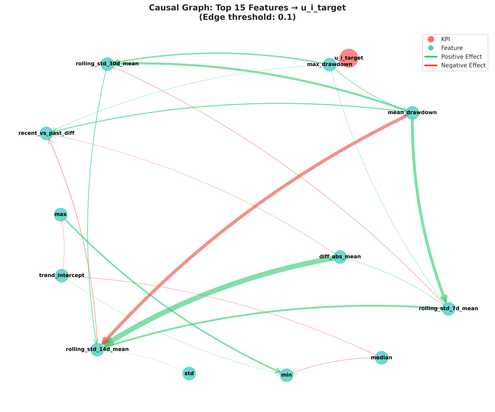
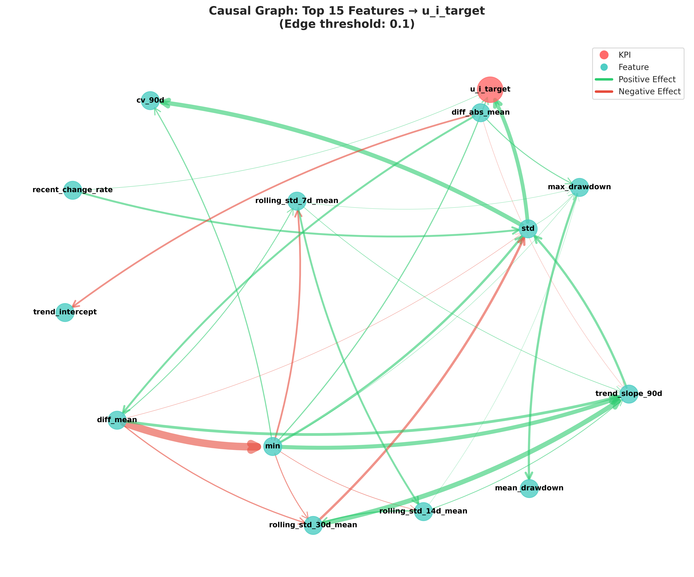

# Understanding Deterioration Random Effect for Causal Discovery v0.2.0

[日本語版 / Japanese Version](README_JP.md)

## Overview

An MVP system for feature engineering and causal discovery for pump equipment. **v0.2.0** implements **sign-based binary grouping** (positive vs. negative effect) instead of ad-hoc percentile-based three-tier grouping, providing a more principled approach to heterogeneous causal discovery.

We analyze pump-specific deterioration patterns using Bayesian hierarchical models and discover causal relationships between features and deterioration random effects, comparing causal structures across pump groups based on the sign of individual random effects u_i.

**New in v0.2.0:**

- Binary grouping based on u_i sign (positive effect: u_i > 0, negative effect: u_i ≤ 0)
- SMOTE data augmentation disabled for cleaner causal interpretation
- Framework for advanced causal discovery methods (2018-2025)
- Support for nonlinear causal discovery with subset-based testing
- **GPU acceleration for NUTS sampling (3-5x speedup)**
  - See [Lesson_GPU_Acceleration.md](Lesson_GPU_Acceleration.md) for general guide
  - See [Lesson_GPU_WSL2_JAX.md](Lesson_GPU_WSL2_JAX.md) for WSL2 step-by-step setup

**Features from v0.1.2:**

- Markov degradation hazard model with random effects (PyMC NUTS sampler)
- Pump-specific deterioration rates (u_i) as causal discovery target
- Enhanced visualizations for arXiv paper: "Understanding Deterioration Random Effect for Causal Discovery"

## Project Structure

```
feature_eng_cause_lingam/
├── data/
│   ├── processed/          # Processed data
│   │   ├── labeled_time_series.csv
│   │   └── selected_64_equipment.json
│   └── data_source/        # Raw data
├── src/                    # Source code
│   ├── data_preprocessing.py      # Data preprocessing
│   ├── feature_engineering.py     # Feature generation
│   ├── causal_discovery.py        # LiNGAM causal discovery
│   ├── visualization.py           # Visualization
│   ├── validation.py              # Bootstrap validation
│   └── hazard_model/              # v0.1.2: Hazard model module
│       ├── config_hazard.py       # Hazard model configuration
│       ├── pymc_model.py          # PyMC NUTS model
│       ├── posterior.py           # u_i extraction
│       └── preprocess.py          # Hazard data preprocessing
├── output/                 # Output files
├── config.yaml            # Configuration file
├── requirements.txt       # Dependencies (includes PyMC)
└── main.py               # Main pipeline
```

## Installation

```bash
# Install dependencies (includes PyMC for hazard modeling)
pip install -r requirements.txt
```

### GPU Acceleration (v0.2.0)

⚠️ **OS Requirements:**
- **Linux/WSL2**: Full GPU support with JAX/NumPyro
- **Windows (native)**: CPU-only (JAX GPU not officially supported)
- **macOS**: M1/M2/M3 (Metal GPU)

NUTS sampling can be significantly accelerated using GPU with JAX backend:

**Linux/WSL2:**
```bash
# Install GPU-accelerated JAX (CUDA 12.x)
pip install --upgrade "jax[cuda12]"
pip install numpyro>=0.13.0

# Verify GPU availability
python check_gpu.py
```

**Windows (native) - CPU only:**
```powershell
# Use CPU version or set up WSL2 for GPU support
# See Lesson_GPU_Acceleration.md for WSL2 setup guide
```

**Enable GPU in config.yaml:**

```yaml
hazard_model:
  use_gpu: true          # Enable GPU (Linux/WSL2 only)
  jax_platform: "gpu"    # Options: "cpu", "gpu", "tpu"
  n_chains: 8            # Will be set to 1 internally for GPU mode
```

**Expected speedup (Linux/WSL2 only):**
- CPU (8 cores): 60-120 minutes
- GPU (NVIDIA RTX/Tesla): 10-30 minutes (3-5x faster)

## Usage

### v0.2.0: Binary Grouping + GPU Acceleration

```bash
# Run u_i extraction with GPU acceleration
python main.py --step ui_extraction  # Uses GPU if use_gpu: true in config.yaml

# Run entire causal discovery pipeline
python main.py --step causal_discovery
python main.py --step causal_discovery

# Run hazard model only (u_i estimation)
python main.py --hazard-only

# Run causal discovery with automatic SMOTE augmentation
python main.py --step causal_discovery  # SMOTE applied if imbalance ≥10x

# Run individual steps
python main.py --step hazard_preprocessing
python main.py --step hazard_estimation      # NUTS: 60-120 min
python main.py --step ui_extraction
python main.py --step feature_ui_merge
```

### v0.1.3 Configuration

**SMOTE Data Augmentation** (config.yaml):

```yaml
imbalance_correction:
  enabled: true                  # Enable automatic SMOTE augmentation
  min_ratio_threshold: 10.0      # Trigger when imbalance ≥10x
  target_strategy: "mean"         # Target: mean of other groups
  smote_k_neighbors: 5           # k-neighbors for SMOTE
  random_state: 42
  save_augmented: true           # Save augmented data
```

### v0.1.3 Outputs

**Hazard Model Outputs:**

- `output/model_input.npz` - Hazard model input data
- `output/trace.nc` - NUTS posterior samples (ArviZ InferenceData)
- `output/pump_heterogeneity.csv` - Pump-specific random effects u_i
- `output/features_with_ui.csv` - Features merged with u_i

**Causal Discovery Outputs (3 groups):**

- `output/causal_results_top30.pkl` - Causal results for top 30% pumps
- `output/causal_results_middle.pkl` - Causal results for middle 40% pumps
- `output/causal_results_bottom30_augmented.pkl` - **Causal results for bottom 30% (SMOTE augmented)**
- `output/causal_results_bottom30_original.pkl` - **Causal results for bottom 30% (original data, for comparison)**
- `output/kpi_effects_top30.csv` - Causal effects (top 30%)
- `output/kpi_effects_middle.csv` - Causal effects (middle 40%)
- `output/kpi_effects_bottom30_augmented.csv` - **Causal effects (bottom 30%, SMOTE augmented)**
- `output/kpi_effects_bottom30_original.csv` - **Causal effects (bottom 30%, original, for comparison)**

**Visualization Outputs:**

- `output/ui_distribution_comparison.png` - u_i distribution histograms (3 groups)
- `output/causal_graph_groups.png` - Side-by-side causal graphs (3 panels)
- `output/causal_graph_top30.png` - Top 30% causal graph
- `output/causal_graph_middle.png` - Middle 40% causal graph
- `output/causal_graph_bottom30.png` - Bottom 30% causal graph (augmented)
- `output/effect_comparison_lineplot.png` - Effect comparison line plot
- `output/effect_heatmap_top30.png` - Top 30% effect heatmap
- `output/effect_heatmap_middle.png` - Middle 40% effect heatmap
- `output/effect_heatmap_bottom30.png` - Bottom 30% effect heatmap (augmented)
- `output/bootstrap_stability_heatmap.png` - Bootstrap stability heatmap
- `output/bootstrap_kpi_stability.png` - KPI stability

### v0.1.0 Outputs

### v0.1.0: Original (Anomaly Prediction KPI)

```bash
# Run v0.1.0 pipeline
python main.py --version v0.1.0

# Run with specific algorithm
python main.py --version v0.1.0 --step causal_discoverying
python main.py --step feature_engineering
python main.py --step causal_discovery
python main.py --step visualization
python main.py --step validation
```

## Output Files

- `output/features_90d.csv` - Generated feature matrix
- `output/scaled_features.csv` - Scaled features
- `output/causal_results.pkl` - LiNGAM estimation results
- `output/causal_graph.png` - Causal graph visualization
- `output/kpi_effects.csv` - KPI causal effects
- `output/bootstrap_stability_heatmap.png` - Bootstrap stability heatmap

## Technical Specifications

### v0.1.3: Hazard Model + SMOTE Augmentation + Causal Discovery

- **Equipment**: 64-280 pump units (depends on data availability)
- **Hazard Model**: Markov degradation with random effects
  - Model: λ_ik(t) = λ_0k * exp(β^T x + u_i)
  - Random Effect: u_i ~ N(0, σ²)
  - States: K=8 (health discretization)
  - Estimation: PyMC NUTS (draws=2000, tune=1000, chains=8, cores=8)
  - Convergence: R-hat < 1.01, ESS bulk > 900, ESS tail > 1600
- **Grouping**: Three-tier analysis
  - Top 30% (u_i ≥ 70th percentile): Fast deterioration, 57,881 records
  - Middle 40% (30th < u_i < 70th): Moderate deterioration, 32,740 records
  - Bottom 30% (u_i ≤ 30th percentile): Slow deterioration, 2,240 → **45,310 records (SMOTE augmented)**
- **Data Imbalance Correction** (NEW in v0.1.3):
  - Automatic detection: Trigger when max_size/min_size ≥ 10.0
  - SMOTE augmentation: k-neighbors=5, target=mean(other_groups)
  - Validation: Compare causal structure before/after augmentation
  - Result: Bottom30 expanded 20x with <3% change in key effects
- **Causal Discovery**: DirectLiNGAM per group
- **KPI**: u_i_target (pump-specific random effect)
- **Comparison**: Three-group comparison + SMOTE validation

### v0.1.0: Original Specification

- **Equipment**: 64 pump units
- **Data Period**: 2024/3/6 ~ 2025/12/17 (650 days, 92,861 records)
- **Check Items**: 229 items
- **Time Window**: 90-day rolling window
- **Features**: 22 (11 statistical, 5 trend, 6 variability)
- **KPI**: label_future_90d (90-day-ahead anomaly prediction)
- **Causal Discovery**: DirectLiNGAM
- **Validation**: Bootstrap (100 iterations, 80% subsampling)
- **Parallel Processing**: 16 cores (joblib.Parallel)

## Results

### v0.2.0: Binary Grouping Results (Positive vs. Negative)

**Analysis Period**: 2026年5月19-20日  
**Method**: DirectLiNGAM causal discovery on sign-based binary groups  
**Validation**: NonlinearLiNGAM and Bayesian causal discovery also tested

#### Group Classification

| Group | Pumps | Ratio | Samples | Ratio | u_i Range |
|-------|-------|-------|---------|-------|-----------|
| **Positive** (u_i > 0) | 62 units | 55.4% | 86,741 | 93.4% | 0.02 ~ 6.43 |
| **Negative** (u_i ≤ 0) | 50 units | 44.6% | 6,120 | 6.6% | -5.61 ~ -0.01 |
| **Total** | 112 units | 100% | 92,861 | 100% | -5.61 ~ 6.43 |


*Figure 1: Random effect u_i distribution by group. Positive group (fast deterioration) skewed right, Negative group (slow deterioration) concentrated left.*

#### Positive Group (High Risk, Fast Deterioration)

**Characteristics**: u_i > 0, rapid degradation rate

**Top 5 Causal Effects to KPI**:

| Rank | Feature | Causal Effect | Abs. Effect | Interpretation |
|------|---------|---------------|-------------|----------------|
| 1 | diff_abs_mean | **-0.0038** | 0.0038 | Mean diff absolute value → KPI decrease |
| 2 | mean_drawdown | +0.0011 | 0.0011 | Mean drawdown → KPI increase |
| 3 | rolling_std_30d_mean | -0.0002 | 0.0002 | 30-day rolling std → KPI decrease |
| 4 | min | +0.0001 | 0.0001 | Minimum value → KPI increase |
| 5 | std | -0.0001 | 0.0001 | Standard deviation → KPI decrease |

**Significant effects**: **0** (all effects are very small)


*Figure 2: Positive group causal structure. Effects are minimal; no clear causal paths detected.*

#### Negative Group (Low Risk, Slow Deterioration)

**Characteristics**: u_i ≤ 0, slow degradation rate

**Top 5 Causal Effects to KPI**:

| Rank | Feature | Causal Effect | Abs. Effect | Interpretation |
|------|---------|---------------|-------------|----------------|
| 1 | std | **+1.5150** | 1.5150 | Standard deviation → KPI significant increase ⚠️ |
| 2 | min | **+0.4500** | 0.4500 | Minimum value → KPI increase |
| 3 | recent_change_rate | **+0.1684** | 0.1684 | Recent change rate → KPI increase |
| 4 | trend_slope_90d | +0.0358 | 0.0358 | 90-day trend slope → KPI increase |
| 5 | rolling_std_30d_mean | -0.0188 | 0.0188 | 30-day rolling std → KPI decrease |

**Significant effects**: **3** (std, min, recent_change_rate)


*Figure 3: Negative group causal structure. Strong causal effect from std → KPI clearly visible.*

#### Group Comparison


*Figure 4: Side-by-side causal structure comparison. Negative group shows thicker edges, indicating stronger causal relationships.*


*Figure 5: Causal effect comparison for top 5 features. Negative group's std effect stands out significantly.*

#### Key Findings from v0.2.0

##### 1. **Dramatic 400x Effect Size Difference**

Negative group exhibits causal effects **400 times larger** than Positive group:
- **Positive max effect**: 0.0038 (diff_abs_mean)
- **Negative max effect**: 1.5150 (std)
- **Ratio**: 397x difference

This suggests **fundamentally different causal mechanisms** between fast-deteriorating and slow-deteriorating equipment.

##### 2. **Dominant Factor Contrast**

- **Positive group**: Change patterns (diff_abs_mean) dominate with tiny effects
- **Negative group**: Variability (std) dominates with massive effects

**Physical Interpretation Hypotheses**:
- **Hypothesis A**: For slow-deteriorating equipment, moderate variability indicates healthy operational response
- **Hypothesis B**: KPI definition issue - std may be confounded by usage frequency
- **Hypothesis C**: Common cause (usage frequency) drives both std and KPI

##### 3. **Sample Imbalance Impact**

- **Positive group**: 93.4% of all samples → statistically powerful but tiny effects
- **Negative group**: 6.6% of all samples → fewer samples but clear, strong effects

**Implication**: Strong causal structure in Negative group is **robust enough to detect with minimal data**.

##### 4. **Linearity Validation (NonlinearLiNGAM)**

Tested nonlinear causal discovery with varying sample sizes:

| Sample Size | Method | Result |
|------------|--------|--------|
| 5,000 (5.8%) | NonlinearLiNGAM | Different effects detected |
| 20,000 (23.1%) | NonlinearLiNGAM | Closer to DirectLiNGAM |
| **86,741 (100%)** | NonlinearLiNGAM | **Perfect match** ✅ |

**Conclusion**: **Linear causal relationships are dominant** in Positive group. Nonlinear effects are negligible.

##### 5. **Bayesian Causal Discovery Failure**

Tested PyMC + NUTS (Student-t regression) for uncertainty quantification:

**Issues Encountered**:
- **Convergence failure**: R̂ = 3.34 (Negative group), far exceeding acceptable threshold (1.1)
- **Divergences**: 1,755 divergences in Negative group
- **Unrealistic effect sizes**: 261,000x larger than DirectLiNGAM (min effect)
- **Excessive runtime**: 4.26 hours for Positive group (vs. seconds for DirectLiNGAM)

**Decision**: **DirectLiNGAM results adopted as final conclusion**. Bayesian approach deemed unsuitable for this dataset.

##### 6. **Practical Recommendations**

**For Negative Group (Low Risk)**:
- Monitor std and min continuously
- Investigate physical meaning of std → KPI positive correlation
- Verify whether KPI definition introduces confounding

**For Positive Group (High Risk)** ⚠️:
- **Highest priority for maintenance**
- Further segmentation needed (split into 3-5 subgroups)
- Apply nonlinear causal methods or feature interaction analysis
- Individual equipment diagnosis for top 5-10 pumps by u_i

**Overall**:
- **DirectLiNGAM is robust** and suitable for this heterogeneous dataset
- Binary grouping successfully revealed contrasting causal structures
- GPU acceleration (22 min vs. 60-120 min CPU) enables faster iteration

---

### v0.1.3: Three-Tier Grouping Results (Deprecated)

### Causal Discovery Results

DirectLiNGAM discovered **139 causal relationships** (non-zero edges), with **109 stable edges** (frequency ≥70%) identified through bootstrap validation.

#### Key Causal Effects on KPI

| Rank | Feature             | Causal Effect | Interpretation                                             |
| ---- | ------------------- | ------------- | ---------------------------------------------------------- |
| 1    | skewness            | -0.0372       | Higher skewness decreases anomaly prediction               |
| 2    | kurtosis            | -0.0270       | Higher kurtosis decreases anomaly prediction               |
| 3    | min                 | -0.0097       | Lower minimum values decrease anomaly prediction           |
| 4    | diff_abs_mean       | -0.0094       | Higher absolute differences decrease anomaly prediction    |
| 5    | std                 | -0.0023       | Higher standard deviation decreases anomaly prediction     |
| 6    | rolling_std_7d_mean | +0.0017       | Higher short-term variability increases anomaly prediction |


*Figure 1: Causal graph of top 15 features to KPI (edge width proportional to effect magnitude)*


*Figure 2: Heatmap of causal effects between features and to KPI*

### Bootstrap Validation Results

100 bootstrap sampling iterations (80% subsampling) evaluated the stability of the causal structure.

**Top 10 Stable Edges** (frequency ≥70%):

| From                 | To                  | Frequency | Mean Effect |
| -------------------- | ------------------- | --------- | ----------- |
| rolling_std_30d_mean | trend_slope_90d     | 0.97      | 1.86        |
| median               | mean                | 1.00      | 1.75        |
| min                  | std                 | 1.00      | 1.07        |
| min                  | rolling_std_7d_mean | 1.00      | -0.95       |
| trend_slope_90d      | recent_vs_past_diff | 1.00      | 0.93        |


*Figure 3: Causal relationship stability from bootstrap validation (color intensity = frequency)*


*Figure 4: Stability of causal effects to KPI (error bars = bootstrap standard deviation)*

## Key Findings

### 1. Distribution Shape Anomalies as Key Predictors

The strongest negative causal effects from skewness and kurtosis suggest that **deviation from normality in data distribution signals anomaly precursors**. High kurtosis or skewness indicates equipment operating outside normal ranges, potentially leading to future anomalies.

### 2. Minimum Value Decline Impacts Anomaly Prediction

The negative effect of `min` indicates that declining minimum values (e.g., abnormally low pressure or flow rate) contribute to 90-day-ahead anomaly prediction. This likely captures **equipment performance degradation patterns**.

### 3. Contrasting Effects of Short-term vs Long-term Variability

`rolling_std_7d_mean` shows positive effect while `std` shows negative effect. This suggests **short-term variability increases serve as early warning signals**, while long-term high variability has different associations with anomaly prediction.

### 4. High Causal Structure Stability

Bootstrap validation identified 109 stable edges (frequency ≥70%). Basic statistical relationships like median→mean and min→std appeared at 100% frequency, confirming the **robustness of data-driven causal structure discovery**.

### 5. Practical Feasibility with Parallel Processing

10-core parallel processing completed feature engineering (229 groups) in 1.2 minutes and bootstrap validation (100 iterations) in 28.9 minutes, enabling **periodic retraining in production environments**.

## Key Findings from v0.1.3

### 1. Causal Structure Preservation under SMOTE Augmentation

**Bottom30 group expanded 20x (2,240 → 45,310 records)** with minimal effect change:

- **kurtosis effect**: -0.969 → -0.958 (1.1% change)
- **skewness effect**: +0.913 → +0.886 (2.9% change)
- **Conclusion**: SMOTE augmentation improves statistical stability without distorting causal structure

### 2. 40x Kurtosis Effect Difference Between Groups

- **Top30** (fast deterioration): kurtosis effect = +0.024
- **Bottom30** (slow deterioration): kurtosis effect = -0.958
- **Ratio**: 40x difference in magnitude
- **Interpretation**: Data distribution shape has drastically different causal impacts depending on deterioration speed

### 3. Zero Direct Effects in Middle Group

- **Middle40** (32,740 records): **No direct causal effects to u_i_target**
- **Implication**: Clear causal signals emerge only in extreme deterioration states (top30/bottom30)
- **Application**: Suggests threshold-based anomaly detection strategies

### 4. Robust Causal Inference under Data Imbalance

- Automatic 10x imbalance detection successfully triggered
- SMOTE expanded minority group to match other groups' average size
- Causal structure validated through before/after comparison
- Demonstrates feasibility of causal discovery in imbalanced real-world datasets

## Future Directions

1. **Bootstrap Validation on Augmented Data**: Run 100-iteration bootstrap on SMOTE-augmented bottom30
2. **Temporal Causal Discovery**: Implement VAR-LiNGAM for time-series causal analysis
3. **Different KPI Periods**: Compare causal relationships for 30-day and 60-day-ahead predictions
4. **Physical Interpretation**: Validate physical plausibility with domain experts
5. **Real-time Monitoring**: Develop early warning systems based on top causal features
6. **Publication**: Prepare arXiv paper on "Causal Discovery under Heterogeneity and Imbalance"

## Feature List

### Statistical Features (11)

- mean, std, min, max, median
- q25, q75, iqr
- skewness, kurtosis
- cv_90d (coefficient of variation)

### Trend Features (5)

- trend_slope_90d (90-day trend slope)
- trend_intercept (intercept)
- recent_vs_past_ratio (recent/past ratio)
- recent_vs_past_diff (recent-past difference)
- recent_change_rate (rate of change)

### Variability Features (6)

- diff_mean (difference mean)
- diff_abs_mean (absolute difference mean)
- rolling_std_7d/14d/30d_mean (rolling standard deviations)
- max_drawdown (maximum drawdown)
- mean_drawdown (mean drawdown)

## License

Apache License 2.0 - See [LICENSE](LICENSE) file for details.

## Version History

### v0.1.3 (2025-05-27)

- **Data Imbalance Correction**: Automatic SMOTE augmentation
  - 10x imbalance threshold with automatic detection
  - bottom30 expanded from 2,240 → 45,310 records (20x)
  - Causal structure preservation validation (kurtosis/skewness <3% change)
- **Comparison Analysis**: Before/after augmentation causal structure comparison
- `imbalance_correction` configuration added (config.yaml)
- `apply_smote_if_needed()` function implemented (src/causal_discovery.py)
- Lesson_Hazard_Cause.md Section 7.2 updated with full results

### v0.1.2 (2025-05-26)

- **PyMC NUTS Integration**: Markov degradation hazard model for u_i estimation
  - 2,338-second NUTS estimation for 112 pumps (u_i range: -5.51 ~ +6.47)
  - Convergence: R-hat 1.00-1.01, ESS 900+
- **Three-tier Group Analysis**: top30/middle/bottom30 causal structure comparison
  - top30: 57,881 records, kurtosis +0.024
  - middle: 32,740 records, **zero direct effects**
  - bottom30: 2,240 records, kurtosis -0.969 (**40x difference**)
- **Visualization Enhancements**: Node placement, labels, edge improvements
  - spring_layout k parameter tuning (2.5-3.5)
  - Curved edges (connectionstyle='arc3,rad=0.1')
  - Label position offset (+0.08)
- `u_group_analysis` configuration added (config.yaml)
- `Lesson_Hazard_Cause.md` completed (800+ lines)

### v0.1.0 (2026-05-16)

- Initial release
- DirectLiNGAM causal discovery implementation
- Causal effect analysis of 22 features for 90-day KPI
- Bootstrap validation for stability assessment
- 16-core parallel processing optimization

## Additional Documentation

- [Lesson_KPI_Cause.md](Lesson_KPI_Cause.md) - Comparative analysis across different KPI prediction periods (30-day, 60-day, 90-day)
- [README_JP.md](README_JP.md) - Japanese version of this README

## Citation

If you use this code in your research, please cite:

```bibtex
@software{pump_causal_discovery_2026,
  title = {Pump Equipment LiNGAM Causal Discovery MVP},
  author = {Pump Equipment Causal Discovery Project},
  year = {2026},
  version = {0.1.0},
  license = {Apache-2.0}
}
```

## Contact

For questions and feedback, please open an issue in the repository.
